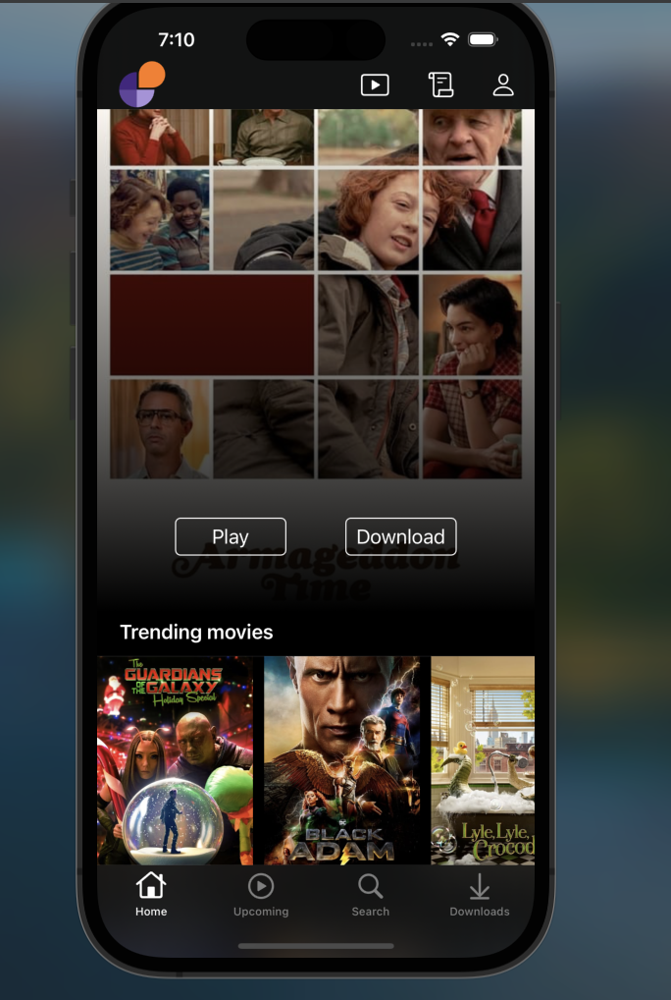

# portfolio-project-cinema-planner

ios uikit for client side and express js to help keep track of movies watched and planning to watch at the cinema

Building the Client side APP uisng Swift and UIKit. I opted to build the UI programatically insetad of using storyboards
Building the API using NestJS

## Link to video of Demo of POC can be found on
https://www.loom.com/share/39132ad5764c4bbb9daf50258af71e3d

## iOS skills, tools and patters displayed
- <b>Swift Package Manager</b> - to add sd_web_image
- <b>WebView</b> - Use of embedded web pages through
- <b>CoreData</b> - To store and persist downloaded Videos
- <b> Notification Center</b> - To add Movies to downloaded list
- <b>Observers</b> - to listen to changes on Notification Center
