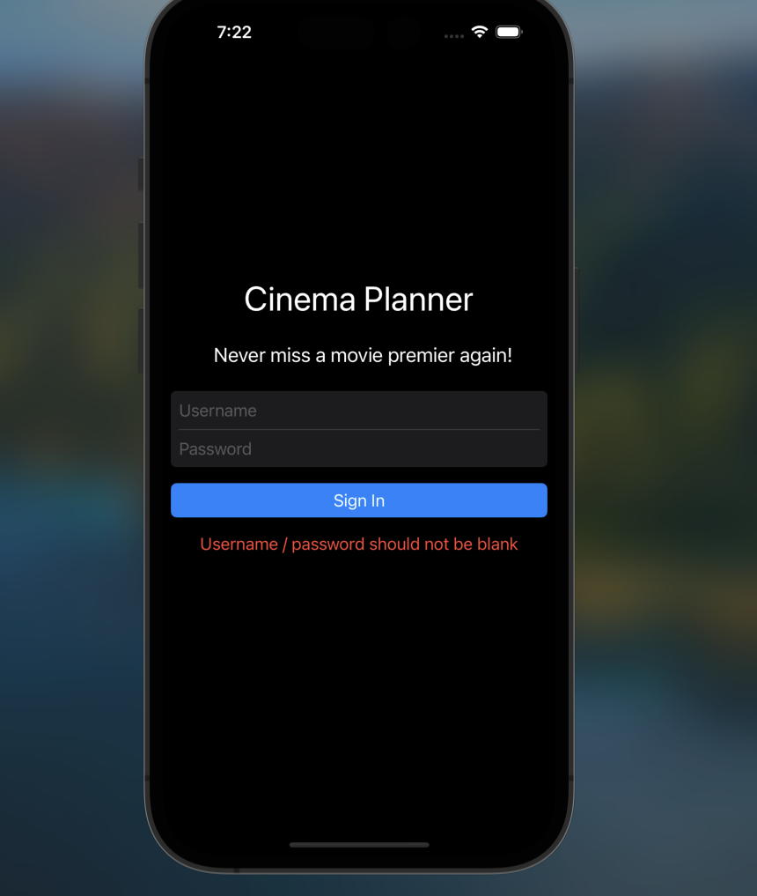
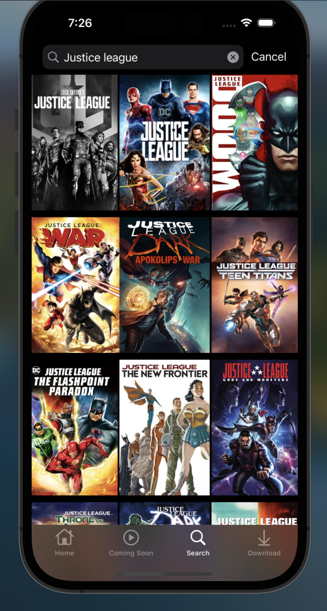
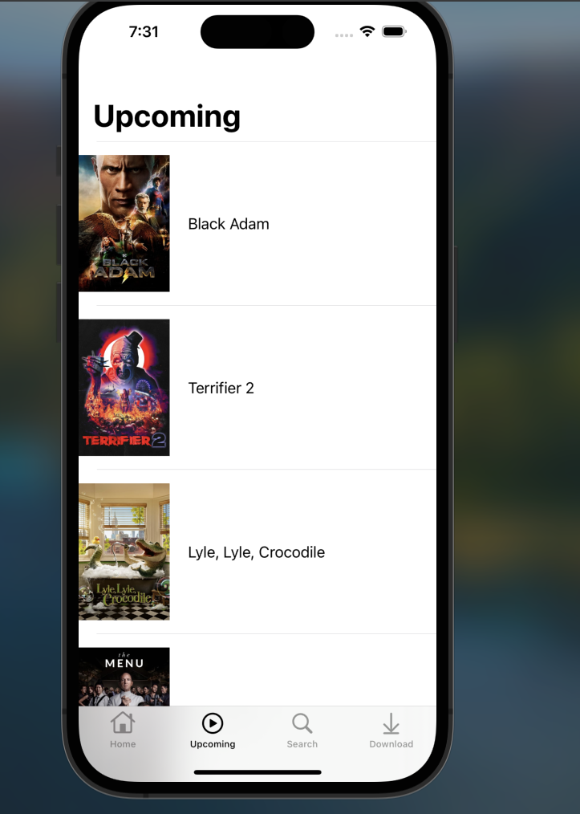

<h1> portfolio-project-cinema-planner </h1>
 

The cinema planner apps aims to help users keep track of hte movies they plan to watch this year

It also helps know which movies they watched this year

ios uikit for client side and express js to help keep track of movies watched and planning to watch at the cinema

Building the Client side APP uisng Swift and UIKit. I opted to build the UI programatically insetad of using storyboards
Building the API using NestJS

<h2> Link to video of Demo of POC can be found on </h2>

https://www.loom.com/share/39132ad5764c4bbb9daf50258af71e3d

 
<h2> iOS skills, tools and patters displayed 
</h2>
- <strong>Swift Package Manager</strong> - to add sd_web_image
- <strong>WebView</strong> - Use of embedded web pages through
- <strong>CoreData</strong> - To store and persist downloaded Videos
- <strong> Notification Center</strong> - To add Movies to downloaded list
- <strong>Observers</strong> - to listen to changes on Notification Center
- <strong>Optimisations</strong> - to keep the application size as small as possible, I limited my reliance on third party packages. For example I decided to build my own methods to make http requests intsead of using a thrid pary library.

<h2>Design Patterns</h2>
<h3><strong>MVVM</strong></3>

THe project is structured to follow the MVVM design pattern.

Intially the project was built to follow MVC however the ViewController started getting too big and I deciced to split it up

<h3><strong>Delegate Pattern</strong></h3>

To keep my classes lean, I opted to use delegates in order to pass on functionality to other classes

<h3>Extensions</h3>

I extended the functionality of the many built in view controllers to add some custom logic specific to the requirements of this application.

I also extracted these extensions into their own files to keep the ViewControllers Lean

    
        import UIKit

        extension OnboardingViewController {
    func style() {
        view.backgroundColor = .systemBackground
        
        imageView.translatesAutoresizingMaskIntoConstraints = false
        imageView.contentMode = .scaleAspectFit
        imageView.image = UIImage(named: heroImageName)
        
        label.translatesAutoresizingMaskIntoConstraints = false
        label.textAlignment = .center
        label.font = UIFont.preferredFont(forTextStyle: .title3)
        label.adjustsFontForContentSizeCategory = true
        label.numberOfLines = 0
        label.text = titleText
    }
    }
    

<h2>System Colors</h2>

I opted to use <i> system colors</i> for this application in order to support light and dark mode.

